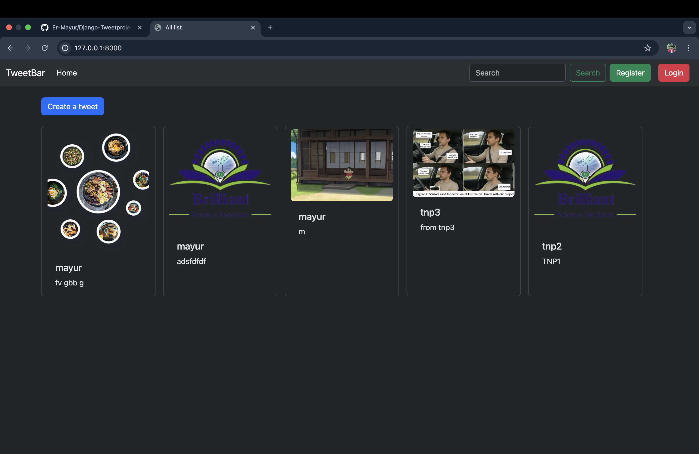
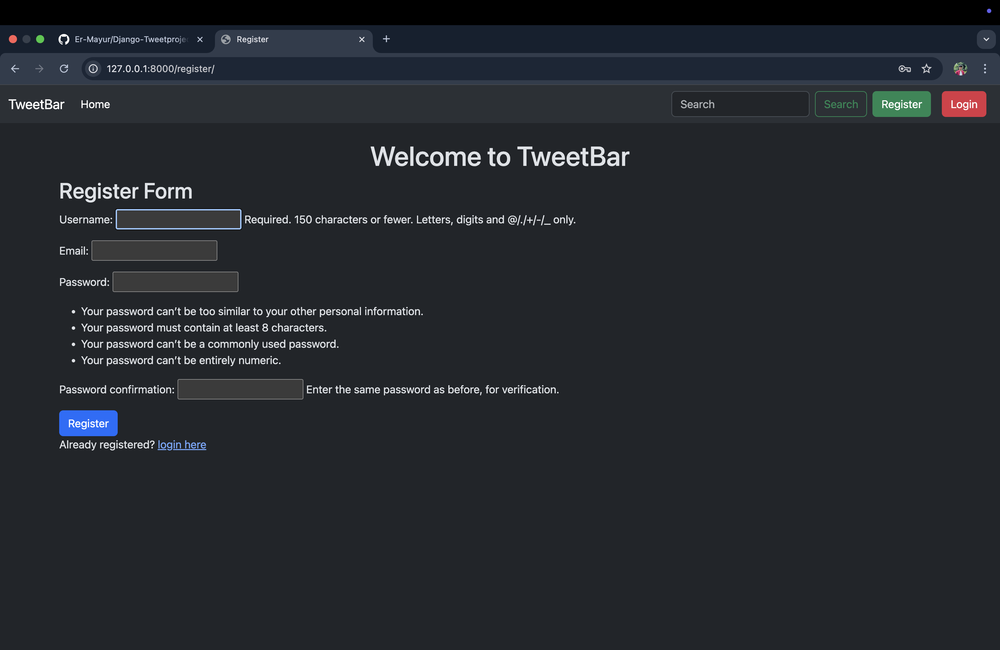
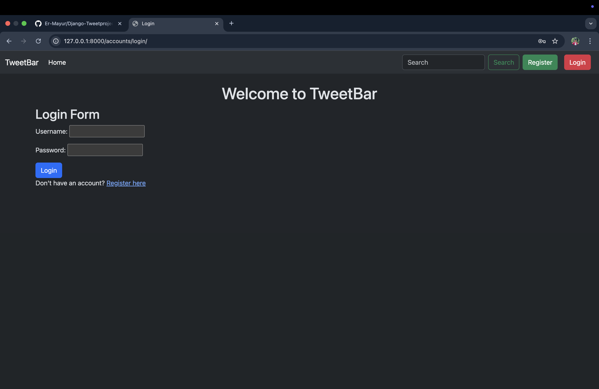
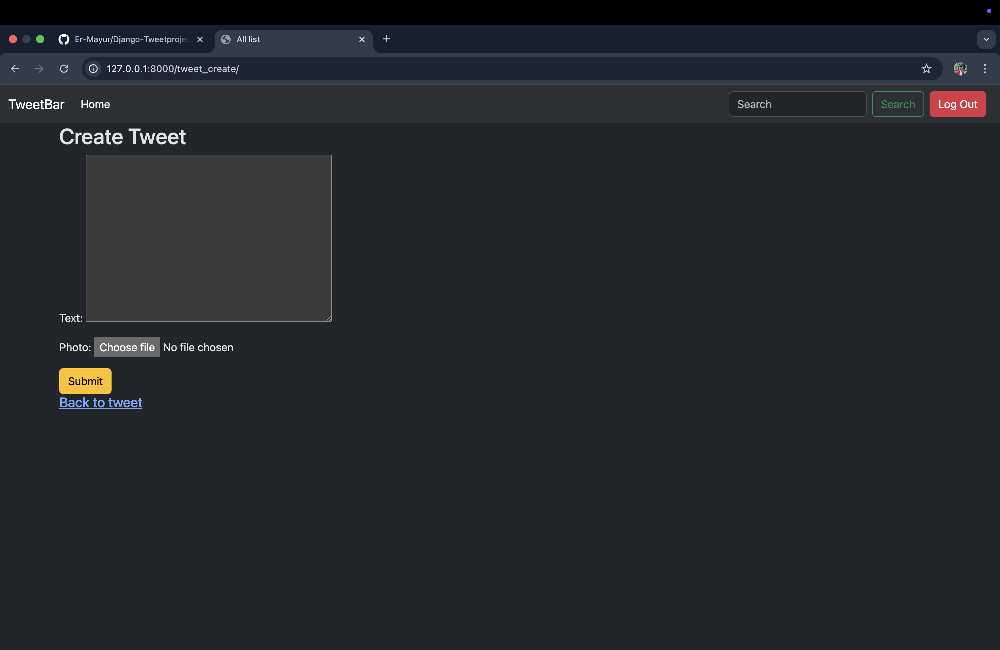
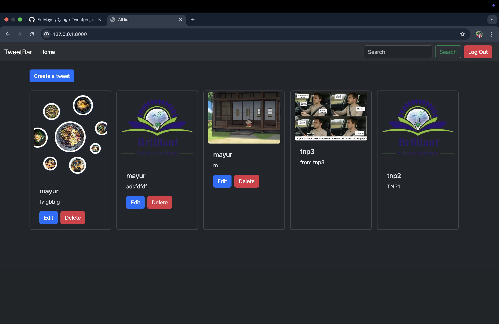

# 🐦 Django TweetProject (Twitter Clone)

A simple **Django CRUD application** inspired by Twitter.  
It allows users to register, log in, and create, update, delete, and view posts ("tweets").  
Built with **Django**, **Bootstrap**, and supports **image uploads** for posts.

<p align="center">
  
  
  
  
  
</p>

---

## 🚀 Live Demo

👉 Try it here: [https://django-tweetproject.vercel.app/](https://django-tweetproject.vercel.app/)

---

## ✨ Features

- 👤 **User Registration** – Create an account with username, email, and password  
- 🔑 **Login / Logout** – Secure authentication using Django’s built-in auth system  
- 📝 **CRUD Operations** – Create, Read, Update, and Delete posts (tweets)  
- 🖼️ **Media Uploads** – Attach images to tweets  
- 🎨 **Bootstrap Styling** – Responsive and clean UI  
- 🗄️ **SQLite Database (default)** – Easily configurable for PostgreSQL/MySQL  
- ☁️ **Deployed on Vercel**  

---

## 🧱 Tech Stack

- **Backend:** Django (Python)  
- **Frontend:** HTML, CSS, Bootstrap  
- **Database:** SQLite (default), PostgreSQL/MySQL optional  
- **Hosting:** Vercel  

---

## 📦 Project Structure

```
Django-Tweetproject/
├── tweet/                  # Main Django app
│   ├── templates/tweet/    # HTML templates
│   │   ├── base.html
│   │   ├── index.html
│   │   ├── tweet_form.html
│   │   └── tweet_confirm_delete.html
│   ├── models.py           # Tweet model
│   ├── views.py            # CRUD views
│   └── urls.py             # Routes
├── accounts/               # User authentication app
│   ├── templates/registration/
│   │   ├── login.html
│   │   ├── register.html
│   │   └── logout.html
├── static/                 # CSS, JS, images
├── media/                  # Uploaded images
├── db.sqlite3              # Default database
├── requirements.txt
├── manage.py
└── screenshots/
    ├── 01-home.png
    ├── 02-register.png
    ├── 03-login.png
    ├── 04-create.png
    └── 05-edit-delete.png
```

---

## 🚀 Getting Started (Local Setup)

### 1) Clone the repo
```bash
git clone https://github.com/Er-Mayur/Django-Tweetproject.git
cd Django-Tweetproject
```

### 2) Create & activate a virtual environment
```bash
# macOS / Linux
python3 -m venv .venv
source .venv/bin/activate

# Windows (PowerShell)
py -m venv .venv
.venv\Scripts\Activate.ps1
```

### 3) Install dependencies
```bash
pip install -r requirements.txt
```

### 4) Run migrations
```bash
python manage.py migrate
```

### 5) Run the app
```bash
python manage.py runserver
```
Open your browser at **http://127.0.0.1:8000**.

---

## 🧪 Usage

1. Register for a new account  
2. Log in with your credentials  
3. Create a tweet (with or without an image)  
4. Edit or delete your own tweets  
5. Log out when done  

---

## ⚙️ Deployment Notes (Vercel)

- Deployed using **Vercel’s Python Runtime**  
- Static files handled via Django’s `collectstatic`  
- Media uploads stored locally (configure cloud storage for production)  

---

## 🙌 Acknowledgements

- Built with ❤️ using **Django**  
- Styling powered by **Bootstrap**  
- Inspired by Twitter’s minimal posting system  

---
